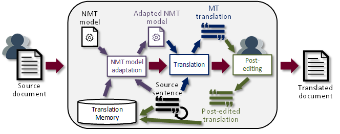
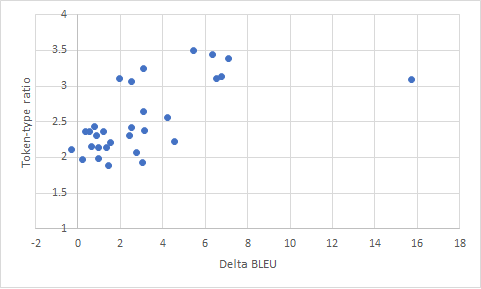

# Runtime domain adaptation
This tutorial is about on-the-fly domain adaptation [1] for improved translation
quality by adapting the NMT model to the text at hand. This tutorial is part of
the Machine Translation Half-Marathon, for which we have set up a docker
container with [Marian](https://marian-nmt.github.io/) and Lucene translation
memory. If you end up doing this Tutorial on your own time and infrastructure,
you might want to read about how to set it up
[here](https://github.com/marian-cef/marian-examples/tree/master/adaptive) and
use models from [here](http://data.statmt.org/heafield/models.tar.gz).

## Introduction
Although on-the-fly domain adaptation can be used in various ways, in this
tutorial, we consider a scenario that mimics the workflow of a professional
translator. We will translate sentences one by one. After receiving each machine
translation, we will imitate post-editing and give feedback by returning the
corresponding reference translation to the translation system. This way, upon
receiving the subsequent translation requests, the machine translation model can
be adapted using relevant sentences from the translation memory.



## Software dependencies
For this tutorial, we have set up: 
  1. Marian NMT framework with on-the-fly domain adaptation capability running as a web service
  2. Lucene translation memory service 
  3. A service that glues both together by handling requests
  4. Pre-installed the necessary tools
  
If you end up doing this Tutorial on your own time and infrastructure, you might
want to read about how to set it up
[here](https://github.com/marian-cef/marian-examples/tree/master/adaptive) and
use models from [here](http://data.statmt.org/heafield/models.tar.gz). Apart
from those we will be using multiple different tools to preprocess the data and
measure the translation quality at the end. You must install these tools before
you begin to work on your enviroment.

### Pre-installed tools
These tools should already be available on the shared server we're using for the
tutorial. You should install these only if you're following the tutorial using
your own computer. These tools should be easily available through your Linux
distribution's package manager. The setup instructions will target Ubuntu using
the `apt` packaging tool. If you're not using Linux, please search for setup
instructions online.

We will need Python 3 (we've used Python 3.6.9 when testing the instructions in
the tutorial) and Perl to run data processing scripts, Virtualenv to allow
installing Python packages locally without root permissions (instead of
system-wide), git to download some code.
```sh
# Update the package list
sudo apt-get update
# Install the software
sudo apt-get install python3 perl virtualenv git
```

### Install Python tools in a virtual environment
Use the `virtualenv` command to create a local directory called `venv` (or any
other name you choose) for storing the Python tools. Then activate the virtual environment.
```sh
# Create the virtual environment
virtualenv venv --python=/usr/bin/python3
# Activate it
. ./venv/bin/activate
```

Now install some Python tools that we will be using
```sh
pip install sacrebleu subword-nmt requests
```

### Download Moses
We will be using the scripts from Moses decoder to pre-process data. Clone the
official Moses git repository to your home directory.
```
git clone https://github.com/moses-smt/mosesdecoder.git ~/mosesdecoder
```

## Data preparation
First we need to prepare the data that we will be using to adapt the generic NMT
model to the domain of the document we want to translate. First we will set up
some tools and preprocess the data.

```
git clone https://github.com/tilde-nlp/runtime-domain-adaptation-tutorial ~/tutorial
```
This should give you: 
```
tutorial/
├─data/
  ├─ news/
  ├─ medical/
├─models/
  ├─ ende.bpe
  ├─ trucase.de
  ├─ trucase.en
```

### Preprocessing the data
Preprocessing the data involves:
1. punctuation normalization,
2. tokenization,
3. truecasing,
4. byte-pair encoding.

These steps are needed to convert the text into a form that's expected by the
NMT model.

#### Set some variables

These will be used down below.
```
src=en
trg=de
moses_scripts=~/mosesdecoder/scripts
models=~/tutorial/models
# We need an unique identifier to use when translating so that the saved sentences
# don't clash among the participants of this tutorial
UUID=$USER-$RANDOM
# For this tutorial, we will rely on existing translation services that have been made
# available on localhost on ports 5010 through 5016. Here we randomize the port
# to achieve load balanding. You should set the PORT to a specific value if you're
# following along on your own hardware
PORT=501$(expr $RANDOM % 7)
```
Next choose one of the files from `~/tutorial/data/medical` data and set `prefix` to file name ommiting the language code (e.g., `~/tutorial/data/medical/EMEA.de-en.6`):
```sh
prefix=
```

#### Punctuation normalization
Punctuation normalization attempts to reduce the variability of punctuation use
in text by converting classes of similar punctuation into a single normal form.
E.g., multiple spaces are converted to a single space, quote characters like «,
'', „ are converted to ", etc.

Apply `normalize-punctuation.perl` from Moses scripts to the source and target
side of the parallel corpus.

```sh
# Process source
cat ${prefix}.${src} \
  | $moses_scripts/tokenizer/normalize-punctuation.perl \
  > ${prefix}.norm.${src}

# Process target
cat ${prefix}.${trg} \
  | $moses_scripts/tokenizer/normalize-punctuation.perl \
  > ${prefix}.norm.${trg}
```

#### Tokenization
Tokenization takes running text as input to output the text where words and
other items have spaces inserted between them. Example of a tokenized version
for the input sentence: *"I feel funky," said Alice to Bob's cat.* is *" I feel
funky , " said Alice to Bob 's cat .*

```sh
# Process source
cat ${prefix}.norm.${src} \
  | $moses_scripts/tokenizer/tokenizer.perl -l ${src} -no-escape -threads 1 \
  > ${prefix}.tok.${src}

# Process target
cat ${prefix}.norm.${trg} \
  | $moses_scripts/tokenizer/tokenizer.perl -l ${trg} -no-escape -threads 1 \
  > ${prefix}.tok.${trg}
```

#### Truecasing
Truecasing converts word casing into a standard form regardless of its place in
the sentence. E.g., English common nouns that appear at the start of the sentence get
lowercased, while propernouns are left as is.
Truecasing uses a pre-trained truecasing model that must match the one that was
used when training the system.

```sh
# Process source
$moses_scripts/recaser/truecase.perl \
  --model ${models}/trucase.${src} -a \
  < ${prefix}.tok.${src} \
  > ${prefix}.tc.${src}

# Process target
$moses_scripts/recaser/truecase.perl \
  --model ${models}/trucase.${trg} -a \
  < ${prefix}.tok.${trg} \
  > ${prefix}.tc.${trg}
```

#### Apply BPE
Byte-pair encoding (BPE) breaks down words into subword units -- a set of common
parts shared among all words. E.g.,
> equipment and materials are necessary but not supplied
turns into
> equipment and materi@@ als are n@@ ec@@ es@@ sary but not suppl@@ ied

```sh
# Process source
subword-nmt apply-bpe -c ${models}/${src}${trg}.bpe < ${prefix}.tc.${src} > ${prefix}.bpe.${src}
# Process target
subword-nmt apply-bpe -c ${models}/${src}${trg}.bpe < ${prefix}.tc.${trg} > ${prefix}.bpe.${trg}
```


## Translation
To evaluate the effectiveness of runtime-domain adaptation, we will compare how
it performs relative to regular translation. To do so, we will simulate a human
translator who's translating a document by post-editing an NMT system's outputs.
In scenario a) the *translator* will be continuously submitting the post-edited
sentences to supply the NMT system with examples to use to adapt to the domain
of the document. In scenario b) run-time domain adaptation will not be used.

Note, during the tutorial we will be connecting to existing translation services
that have been made available on localhost. If you're following along on your
own hardware you should set up [the adaptive Marian
example](https://github.com/marian-cef/marian-examples/tree/master/adaptive) and
use that with models from [here](http://data.statmt.org/heafield/models.tar.gz).

### Runtime domain adaptation (scenario a)
Run the `client.py` script by supplying it with an url to the runtime domain
adaptation webservice, your unique ID and source and target files.

```sh
~/tutorial/client.py --uid $UUID \
  --source ${prefix}.bpe.${src} --target ${prefix}.bpe.${trg} \
  --source-lang ${src} http://localhost:$PORT | \
  sed "s/@@ //g" | \
  $moses_scripts/tokenizer/detokenizer.perl -l ${trg} \
  > output.dynamic.${trg}
```

### Regular translation (scenario b)
To translate without using runtime domain adaptation, simply use the same
command as previously without supplying the `--target` option.

```sh
~/tutorial/client.py --uid $UUID \
  --source ${prefix}.bpe.${src} \
  --source-lang ${src} http://localhost:$PORT | \
  sed "s/@@ //g" | \
  $moses_scripts/tokenizer/detokenizer.perl -l ${trg} \
  > output.regular.${trg}
```

### Calculating results
Calculate BLEU for both outputs to compare the quality of translations.

```sh
# Calculate BLEU for the translations that used runtime domain adaptation
sacrebleu ${prefix}.$trg -lc < output.dynamic.$trg | tee dynamic.bleu

# Calculate BLEU for the translations that didn't use runtime domain adaptation
sacrebleu ${prefix}.$trg -lc < output.regular.$trg | tee regular.bleu
```
What translation quality improvement (as measured in BLEU) did you get? If you used one of the medical texts, you probably got two or more BLEU point improvement. 
Try to repeat the same steps, but this time use one of the news articles (`data/news`)!

## Big Picture
If you managed to translate both the text from the medical domain and one of the
news articles, you probably noticed that runtime-domain adaptation was more
effective for the text from the medical domain but less so for the news article.
At least, that is the general trend we found. After translating *all* news
articles and *all* texts from the medical domain in both scenarios, we found
that, on average, the runtime-domain adaptation yielded a 6.2 BLEU improvement
for texts from the medical domain. In comparison, it gave only 1.7 BLEU
improvement for the news articles.

So what are the deciding factors on whether or not runtime-domain adaptation
will improve translation quality? One aspect that has an impact on the
effectiveness of runtime-domain adaptation is the repetitiveness of text. Texts
that tend to be technical reuse the same words and phrases often, while texts
that aim to entertain tend to strive for the opposite by using richer
vocabulary. A proxy for text repetitiveness is the token-to-type ratio. That is
the ratio between the number of running words (tokens) and unique words (types)
in the sentence. For example, the sentence "*the black cat and the withe cat .*"
has 8 tokens, but only 6 types (*"the" "black" "cat" "and" "white" "."*), thus
its token-to-type ratio is 1.33.

You can get the number of tokens by running `wc -w < ${prefix}.tc.${trg}` and
you can get the number of types by running `cat ${prefix}.tc.${trg} | tr " "
"\n" | sort | uniq | wc -l`


We plotted the token-to-type ratio against the difference between BLEU scores of translation obtained with and without runtime-domain adaptation: 



We also calculated Spearman's Rho (rs), which measures the strength and
direction of the relationship between two variables. We obtained *rs*=0.63,
(*p*=0.00017) for this data, which suggests that the association between
token-to-type ratio and the improvement of translation quality can be considered
statistically significant.

### Caveats
So on-the-fly domain adaptation works well for texts with a high word and phrase repetition rate, but when does it work poorly? 
On-the-fly domain adaptation is unsuitable for cases when the same target word or phrase is translated inconsistently (an example might be two different projects with inconsistent terminology conventions). It also won't work well when the text being translated is not from a novel domain. Last but not least,  on-the-fly domain adaptation is much slower and more resource-demanding and thus is not suitable for speed-critical applications. 


## References
[1] Farajian, M. Amin, Marco Turchi, Matteo Negri, and Marcello Federico.
"Multi-domain neural machine translation through unsupervised adaptation." In
Proceedings of the Second Conference on Machine Translation, pp. 127-137. 2017.
